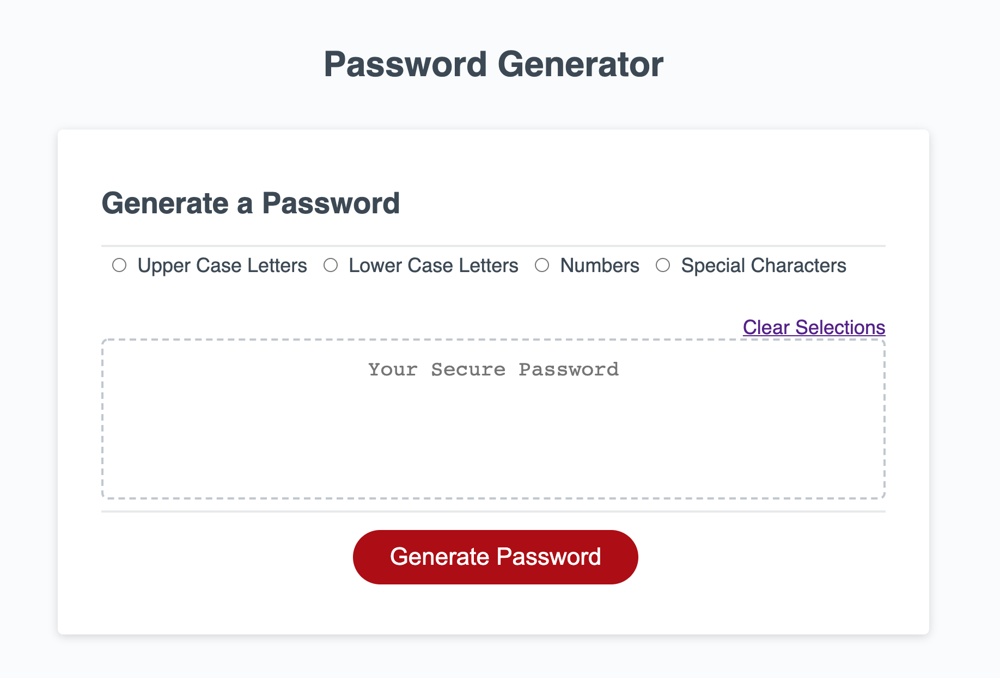

# password-generator
* Security is at the forefront of everything on the web these days. A strong password is essential, especially in an increasingly digital and online world. With that in mind, as a developer, I created a web application that automatically generates a password based on criteria defined by the user.

## About the Project
This application generates a password based on criteria input by the user. When the user first opens the webpage, they are prompted to enter the desired character length of the password in an alert window. Once the user inputs that information, they may choose any combination of the 4 password critera - upper case letters, lower case letters, numbers, and special characters. After making the choices, the user then clicks the "generate password" button, and a password is revealed that matches the critera selections and length the user defined.

## Screenshot
Attached is the pathway to a screenshot of the web application:

## Getting Started

Enter the following link into your browser to use this application:

https://vbmisra.github.io/password-generator/

To view the applications code, visit the Github repository here:

https://github.com/vbmisra/password-generator
